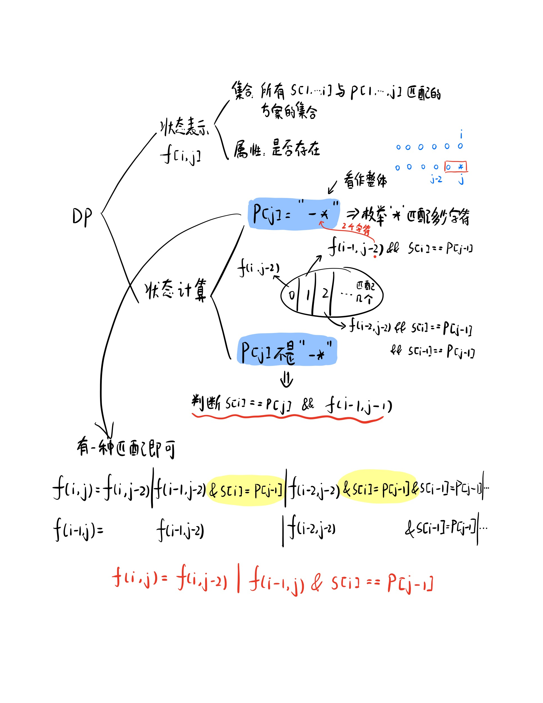

[剑指 Offer 19. 正则表达式匹配](https://leetcode-cn.com/problems/zheng-ze-biao-da-shi-pi-pei-lcof/)

请实现一个函数用来匹配包含'. '和'*'的正则表达式。模式中的字符'.'表示任意一个字符，而'*'表示它前面的字符可以出现任意次（含0次）。在本题中，匹配是指字符串的所有字符匹配整个模式。例如，字符串"aaa"与模式"a.a"和"ab*ac*a"匹配，但与"aa.a"和"ab*a"均不匹配。

示例 1:
```sh
输入:
s = "aa"
p = "a"
输出: false
解释: "a" 无法匹配 "aa" 整个字符串。
```

示例 2:
```sh
输入:
s = "aa"
p = "a*"
输出: true
解释: 因为 '*' 代表可以匹配零个或多个前面的那一个元素, 在这里前面的元素就是 'a'。因此，字符串 "aa" 可被视为 'a' 重复了一次。
```

示例 3:
```sh
输入:
s = "ab"
p = ".*"
输出: true
解释: ".*" 表示可匹配零个或多个（'*'）任意字符（'.'）。
```

示例 4:
```sh
输入:
s = "aab"
p = "c*a*b"
输出: true
解释: 因为 '*' 表示零个或多个，这里 'c' 为 0 个, 'a' 被重复一次。因此可以匹配字符串 "aab"。
```

示例 5:
```sh
输入:
s = "mississippi"
p = "mis*is*p*."
输出: false
```

- s 可能为空，且只包含从 a-z 的小写字母。
- p 可能为空，且只包含从 a-z 的小写字母以及字符 . 和 *，无连续的 '*'。

注意：本题与主站 10 题相同：https://leetcode-cn.com/problems/regular-expression-matching/

思路：
<div></div>

代码：
```python
class Solution:
    def isMatch(self, s: str, p: str) -> bool:
        # 让下标从1开始
        n=len(s)
        m=len(p)
        s=' '+s
        p=' '+p
        ret=[[False]*(m+1) for i in range(n+1)]
        ret[0][0]=True
        for i in range(n+1):
            # 因为p可能会匹配空串，所以i可以从0开始
            for j in range(1,m+1):
                # 把'*'和它前面的字符看作整体
                if j+1<=m and p[j+1]=='*':
                    continue
                if i>0 and p[j]!='*':
                    ret[i][j]=ret[i-1][j-1] and (p[j]==s[i] or p[j]=='.')
                elif p[j]=='*':
                    ret[i][j]=ret[i][j-2] or i>0 and ret[i-1][j] and (s[i]==p[j-1] or p[j-1]=='.') # 不要把i>0直接写成i，否则ret[i][j]可能会被赋值为0
        return ret[n][m]
```
