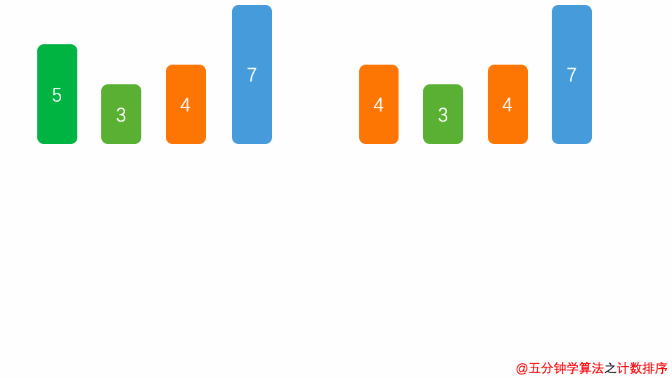

# 1. 介绍
## 1.1 排序算法分类
1. 内部排序: 数据记录在内存中进行排序
2. 外部排序: 因排序的数据很大，一次不能容纳全部的排序记录，在排序过程中需要访问外存
<div align="center"></div>


## 1.2 关于时间复杂度
1. 平方阶($O(n^2)$)排序 各类简单排序：*直接插入、直接选择和冒泡排序*
2. 线性对数阶($O(n\log(n))$)排序：*快速排序、堆排序和归并排序*
3. $O(n^{1+§})$排序，§是介于0和1之间的常数：*希尔排序*
4. 线性阶($O(n)$)排序：*基数排序*，此外还有 *桶、箱排序*

## 1.3 关于稳定性
1. 稳定的排序算法：*冒泡排序、插入排序、归并排序和基数排序*
2. 不稳定的排序算法：*选择排序、快速排序、希尔排序、堆排序*

# 2. 细节
## 2.1 冒泡排序
- 步骤
1. 比较相邻的元素。如果第一个比第二个大，就交换他们两个。
2. 对每一对相邻元素作同样的工作，从开始第一对到结尾的最后一对。这步做完后，最后的元素会是最大的数。
3. 针对所有的元素重复以上的步骤，除了最后一个。
4. 持续每次对越来越少的元素重复上面的步骤，直到没有任何一对数字需要比较。
<div align="center"></div>

- 实现
```python
def bubble_sort(arr):
    '''
    如果没有逆序对，提前退出循环
    '''
    n = len(arr)
    for i in range(n-1):
        swapped = False
        for j in range(n-1-i):
            if arr[j] > arr[j+1]:
                arr[j],arr[j+1] = arr[j+1],arr[j]
                swapped = True
        # print(arr)
        if not swapped:
            break
    return arr
```

## 2.2 选择排序
- 步骤
1. 首先在未排序序列中找到最小（大）元素，存放到排序序列的起始位置。
2. 再从剩余未排序元素中继续寻找最小（大）元素，然后放到已排序序列的末尾。
3. 重复第二步，直到所有元素均排序完毕。
<div align="center"></div>

- 实现
```python
def selection_sort(arr):
    n = len(arr)
    for i in range(n):
        min = i
        for j in range(i+1, n):
            if arr[j] < arr[min]:
                min = j
        arr[i],arr[min] = arr[min],arr[i]
        # print(arr)
    return arr
```

## 2.3 插入排序
- 步骤
1. 将第一待排序序列第一个元素看做一个有序序列，把第二个元素到最后一个元素当成是未排序序列。
2. 从头到尾依次扫描未排序序列，将扫描到的每个元素插入有序序列的适当位置。（如果待插入的元素与有序序列中的某个元素相等，则将待插入元素插入到相等元素的后面。）
<div align="center"></div>

- 实现
```python
def insertion_sort(arr):
    n = len(arr)
    for i in range(n):
        cursor = arr[i]
        pos = i
        while pos > 0 and arr[pos-1] > cursor:
            # 大于cursor就一直往前移，前面的数往后补位
            arr[pos] = arr[pos-1]
            pos = pos-1
        # 最后再赋值
        arr[pos] = cursor
        # print(arr)
    return arr
```

## 2.4 希尔排序
希尔排序，也称递减增量排序算法，是插入排序的一种更高效的改进版本。但希尔排序是非稳定排序算法。
希尔排序是基于插入排序的以下两点性质而提出改进方法的：
1. 插入排序在对几乎已经排好序的数据操作时，效率高，即可以达到线性排序的效率
2. 插入排序一般来说是低效的，因为**插入排序每次只能将数据移动一位**
**基本思想**：先将整个待排序的记录序列分割成为若干子序列分别进行直接插入排序，待整个序列中的记录“基本有序”时，再对全体记录进行依次直接插入排序。

- 步骤
1. 选择一个增量序列$t_1$, $t_2$, ... ,$t_k$，其中$t_i>t_j$, $t_k=1$；（序列是递减的）
2. 按增量序列个数 k，对序列进行 k 趟排序；
3. 每趟排序，根据对应的增量$t_i$，将待排序列分割成若干长度为 m 的子序列，分别对各子表进行直接插入排序。仅增量因子为 1 时，整个序列作为一个表来处理，表长度即为整个序列的长度。
<div align="center"></div>

- 实现
```python
def shell_sort(arr):
    '''
    相当于套了一个gap的插入排序：每次排序的对象是数组中间隔gap的元素
    '''
    n = len(arr)
    gap = n//2
    while gap > 0: # gap=0是循环出口
        for i in range(gap, n):
            cursor = arr[i]
            pos = i
            while pos >= gap and arr[pos-gap] > cursor:
                arr[pos] = arr[pos-gap]
                pos -= gap
            arr[pos] = cursor
        # print(arr)
        gap = gap//2
    return arr
```
## 2.5 归并排序
- 步骤
1. 申请空间，使其大小为两个已经排序序列之和，该空间用来存放合并后的序列；
2. 设定两个指针，最初位置分别为两个已经排序序列的起始位置；
3. 比较两个指针所指向的元素，选择相对小的元素放入到合并空间，并移动指针到下一位置；
4. 重复步骤 3 直到某一指针达到序列尾；
5. 将另一序列剩下的所有元素直接复制到合并序列尾。
<div align="center"></div>

- 实现
```python
def merge_sort(arr):
    if len(arr) <= 1:
        return arr
    mid = len(arr)//2
    left,right = arr[:mid],arr[mid:]
    return merge(merge_sort(left), merge_sort(right), arr.copy())

def merge(left, right, merged):
    l,r = 0,0
    while l < len(left) and r < len(right):
        if left[l] <= right[r]:
            merged[l+r] = left[l]
            l+=1
        else:
            merged[l+r] = right[r]
            r+=1
    for l in range(l, len(left)): # 注意这里的l和r
        merged[l+r] = left[l]
    for r in range(r, len(right)):
        merged[l+r] = right[r]
    return merged
```

## 2.6 快速排序
快速排序使用分治法（Divide and conquer）策略来把一个串行（list）分为两个子串行（sub-lists）。本质上来看，快速排序应该算是在**冒泡排序基础上的递归分治法**。
快速排序通常明显比其他 Ο(nlogn) 算法更快，因为它的**内部循环（inner loop）可以在大部分的架构上很有效率地被实现出来**。
- 步骤
1. 从数列中挑出一个元素，称为 "基准"（pivot）;
2. 重新排序数列，所有元素比基准值小的摆放在基准前面，所有元素比基准值大的摆在基准的后面（相同的数可以到任一边）。在这个分区退出之后，该基准就处于数列的中间位置。这个称为分区（partition）操作；
3. 递归地（recursive）把小于基准值元素的子数列和大于基准值元素的子数列排序；
<div align="center"></div>

- 实现
```python
def partition(arr, low, high):
    i = low-1 # i是小于pivot的数的索引
    pivot = arr[high]
    
    for j in range(low, high):
        # 遍历low到high，将所有小于pivot的数都提到前面来
        if arr[j] < pivot:
            i += 1
            arr[i],arr[j]=arr[j],arr[i]

    # 将pivot提到索引i之后        
    arr[i+1],arr[high]=arr[high],arr[i+1]
    return (i+1)

def quick_sort(arr, low, high):
    if low < high:
        pivot = partition(arr, low, high)
        quick_sort(arr, low, pivot-1)
        quick_sort(arr, pivot+1, high)
    return arr

########################################

def qsort(arr):
    '''
    简化版，利用了python list的特点
    速度很慢，严格意义上不算快排
    '''
    if len(arr) <= 1:
        return arr
    pivot = arr[-1]
    return qsort([x for x in arr[:-1] if x < pivot]) + [pivot] + qsort([x for x in arr[:-1] if x >= pivot])
```

## 2.7 堆排序
- 步骤
1. 创建一个大顶堆；
2. 把堆首（最大值）和堆尾互换；
3. 把堆的尺寸缩小 1，并调用`heapify()`，目的是把新的数组顶端数据调整到相应位置；
4. 重复步骤 2，直到堆的尺寸为 1。
<div align="center"></div>

- 代码
```python
def heapify(arr, n, i): 
    largest = i  
    l = 2 * i + 1 
    r = 2 * i + 2

#     arr = [1,2,3,6,4,3,7,8,13,5]  
#     print("        {}       ".format(arr[0]))
#     print("    {}       {}   ".format(arr[1], arr[2]))
#     print(" {}    {}   {}   {} ".format(arr[3],arr[4],arr[5],arr[6]))
#     print("{} {} {} ".format(arr[7],arr[8],arr[9]))
#     print("==========================")
    
    if l < n and arr[i] < arr[l]: 
        largest = l 
  
    if r < n and arr[largest] < arr[r]: 
        largest = r 
  
    if largest != i: 
        arr[i],arr[largest] = arr[largest],arr[i]    
        heapify(arr, n, largest) 
  

def heap_sort(arr): 
    n = len(arr) 
  
    # 建立大顶堆：从 n//2-1 逐渐往顶部走 
    for i in range(n//2-1, -1, -1): 
        heapify(arr, n, i) 
  
    # 排序
    for i in range(n-1, 0, -1): 
        # 交换顶部与末端未排序元素
        arr[i], arr[0] = arr[0], arr[i]
        heapify(arr, i, 0) 
        
    return arr
```


## 2.8 计数排序
计数排序是一种非基于比较的排序算法，其空间复杂度和时间复杂度均为O(n+k)，其中k是整数的范围。
计数排序的核心在于将输入的数据值转化为键存储在额外开辟的数组空间中。作为一种线性时间复杂度的排序，计数排序要求**输入的数据必须是有确定范围的整数**。
- 步骤
1. 花O(n)的时间扫描一下整个序列 A，获取最小值 min 和最大值 max
2. 开辟一块新的空间创建新的数组 B，长度为 (max - min + 1)
3. 数组 B 中 index 的元素记录的值是 A 中某元素出现的次数
4. 最后输出目标整数序列，具体的逻辑是遍历数组 B，输出相应元素以及对应的个数
<div align="center"></div>

- 代码
```python
def counting_sort(arr):

    m = min(arr)
    # 对负数设置一个offset
    offset = 0
    if m < 0:
        offset = -m
        for i in range(len(arr)):
            arr[i] += offset
    k = max(arr)
    
    temp_arr = [0] * (k + 1)
    
    for i in range(0, len(arr)):
        temp_arr[arr[i]] += 1

    for i in range(1, k + 1):
        # 向后叠加
        temp_arr[i] += temp_arr[i - 1]

    result_arr = arr.copy()

    for i in range(len(arr) - 1, -1, -1):
        # arr[i]的排位看temp_arr[arr[i]]的数值，并减一（自身）
        result_arr[temp_arr[arr[i]] - 1] = arr[i] - offset
        # 针对重复位情况
        temp_arr[arr[i]] -= 1 
    return result_arr
```

## 2.9 桶排序
桶排序(Bucket sort)是一种基于计数的排序算法。
- 步骤
1. 设置固定数量的空桶。
2. 把数据放到对应的桶中。
3. 对每个不为空的桶中数据进行排序。
4. 拼接不为空的桶中数据，得到结果。
<div align="center"></div>

- 代码
```python
def bucket_sort(arr, bucket_size=5):
    min_value,max_value = min(arr),max(arr)
    bucket_count = (max_value-min_value)//bucket_size + 1
    buckets = [[] for _ in range(bucket_count)]
    
    for i in arr:
        buckets[(i-min_value)//bucket_size].append(i)
        
    sorted_list = []
    for bucket in buckets:
        sorted_list.extend(next_sort(bucket))
        
    return sorted_list
        
def next_sort(arr):
    # 插入排序
    n = len(arr)
    for i in range(n):
        cursor = arr[i]
        pos = i
        while pos>0 and arr[pos-1]>cursor:
            arr[pos] = arr[pos-1]
            pos -= 1
        arr[pos] = cursor
    return arr
```

## 2.10 基数排序
- 步骤
1. 建立一个10进制的表记录每个数的基数
2. 从最低位开始，依次进行一次排序
3. 从最低位排序一直到最高位排序完成以后, 数列就变成一个有序序列
<div align="center"></div>

- 代码
```python
def radix_sort(arr):
    '''
    先按个位排，再按十位排...直到pos>max
    '''
    pos = 1
    max_value = max(arr)
    while pos<max_value:
        queue_list = [list() for _ in range(10)]
        for num in arr:
            digit_number = num // pos % 10
            queue_list[digit_number].append(num)
        index = 0
        for numbers in queue_list:
            for num in numbers:
                arr[index] = num
                index += 1
        pos*=10
    return arr
```

# 参考
1. https://mp.weixin.qq.com/s/vn3KiV-ez79FmbZ36SX9lg
2. https://www.runoob.com/python3/python3-examples.html
3. https://github.com/keon/algorithms
4. https://github.com/TheAlgorithms/Python
